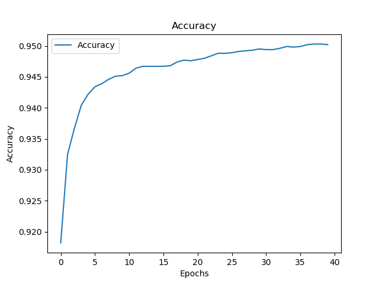

# Proyecto de DNNs con MNIST

## Instrucciones

Utilizar el caso de las notas del texto utilizado en clase (Capitulo 6 del
  Nielsen) para calcular la precisión de una DNN aplicada a la base MNIST bajo
  las condiciones:

- **Epocas:** 40
- **Minibatch:** 10 ejemplos
- **Learning rate (n):** 0.1
- **Parámetro de regularización (lambda):** 5
- **Entradas y capas**
 - [784, 30, 10]
 - [784, 30, 20, 10]
 - [784, 30, 20, 20, 10]

## Desarrollo

Se utilizo cómo base el código del capitulo 8 del Nielse, y de los repositorios
que este propone.

- [M. Nielsen, Neural Networks and Deep Learning](https://github.com/mnielsen/neural-networks-and-deep-learning)
- [Michal Daniel Dobrzanski, Deep Learning Python 3.5](https://github.com/MichalDanielDobrzanski/DeepLearningPython35)

Se utilizo `python3.7`, `numpy`, `matplotlib` y `theano`, el resto de
dependencias están resueltas con los scripts de python locales.

El código se puede ejecutar abriendo el notebook `proyecto_dnn_mnist.ipynb` o directamente con `python proyecto_dnn_mnist.py`.

## Resultados

A continuación se muestran las graficas de los accuracy en cada red con el paso
de las épocas.

| [784, 30, 10] | [784, 30, 20, 10] | [784, 30, 20, 20, 10] |
| - | - | -  |
|  |  |  |

Las salidas del programa se pueden leer en el notebook.

## Código

```python3
import mnist_loader
import network3
from network3 import Network, ConvPoolLayer, FullyConnectedLayer, SoftmaxLayer

# Cargamos MNIST
training_data, validation_data, test_data = network3.load_data_shared()

# Primera red [784, 30, 10]

# Parametros
inputs = 784
layer1 = 30
outputs = 10
epochs = 40
mini_batch_size = 10
learning_rate = 0.1
regularization_parameter = 5.0

# Configuramos la red
net = Network([
    FullyConnectedLayer(n_in=inputs, n_out=layer1),
    SoftmaxLayer(n_in=layer1, n_out=outputs)], mini_batch_size)

# Entrenamos la red
net.SGD(training_data, epochs, mini_batch_size, learning_rate, validation_data, test_data, regularization_parameter)

# Segunda red [784, 30, 20, 10]

# Parametros
layer2 = 20

# Configuramos la red
net = Network([
    FullyConnectedLayer(n_in=inputs, n_out=layer1),
    FullyConnectedLayer(n_in=layer1, n_out=layer2),
    SoftmaxLayer(n_in=layer2, n_out=outputs)], mini_batch_size)

# Entrenamos la red
net.SGD(training_data, epochs, mini_batch_size, learning_rate, validation_data, test_data, regularization_parameter)

# Tercera red [784, 30, 20, 20, 10]

# Parametros
layer3 = 20

# Configuramos la red
net = Network([
    FullyConnectedLayer(n_in=inputs, n_out=layer1),
    FullyConnectedLayer(n_in=layer1, n_out=layer2),
    FullyConnectedLayer(n_in=layer3, n_out=layer3),
    SoftmaxLayer(n_in=layer3, n_out=outputs)], mini_batch_size)

# Entrenamos la red
net.SGD(training_data, epochs, mini_batch_size, learning_rate, validation_data, test_data, regularization_parameter)

```
